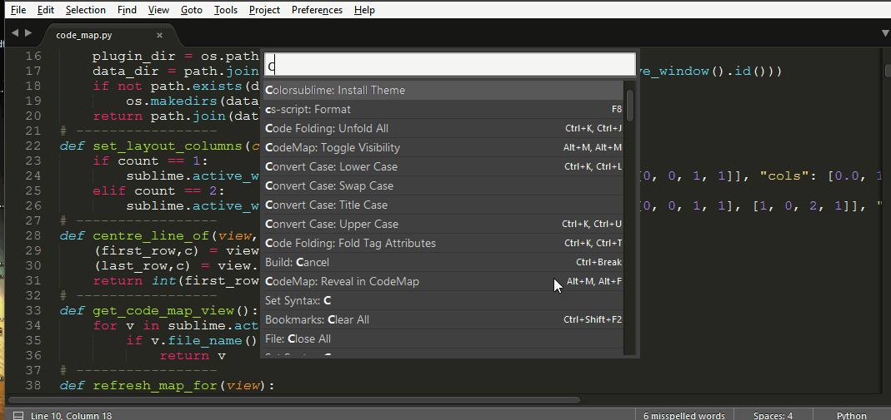

# Sublime CodeMap

A plugin for displaying the code map (code structure tree) in the [Sublime Text](http://sublimetext.com "Sublime Text") editor.

This plugin is a port of [PyMap](https://marketplace.visualstudio.com/items?itemName=OlegShilo.PyMap) Visual Studio extension. 

Plugin currently supports building the code tree for Python. Support for C# is in the pipeline. The design of plugin allows integration of the user defined _tree building_ algorithm for other languages. The _custom syntax_ integration infrastructure and and samples will  be available in the next release. 

## Installation

*__Package Control__*

At this stage the pluging is not available via Package Control. Though it is going to happen very soon.

*__Manual__*

You can install the plugin by cloning `sublime-codemap` repository into your Packages folder or manually placing the download package there.

## Usage
The plugin uses a dedicated view group __Code - Map__ (on right side) to mimic a "side bar" with the content (code tree) that represents code structure of the active view content in the primary view group. 

The code tree automatically refreshes on saving the active document or switching the tabs. The usage is quite simple. You can double-click a node in the code tree and this will trigger navigation to the corresponding area in the code (in active document). Alternatively you can synchronize code tree node selection with the current caret position in the document by triggering `sync_code_map` command either from _Command Palette_ or by the configured shortcut.

## Command Palette

Press `cmd+shift+p`. Type `codemap` to see the available commands:

* *Toggle Visibility* - Jump to the next highlighted error or warning in your code.
* *Synch with View* - Select code tree mode that corresponds the caret position in the code (active viewJ)

## Settings

Currently there is no any settings for the plugin.
